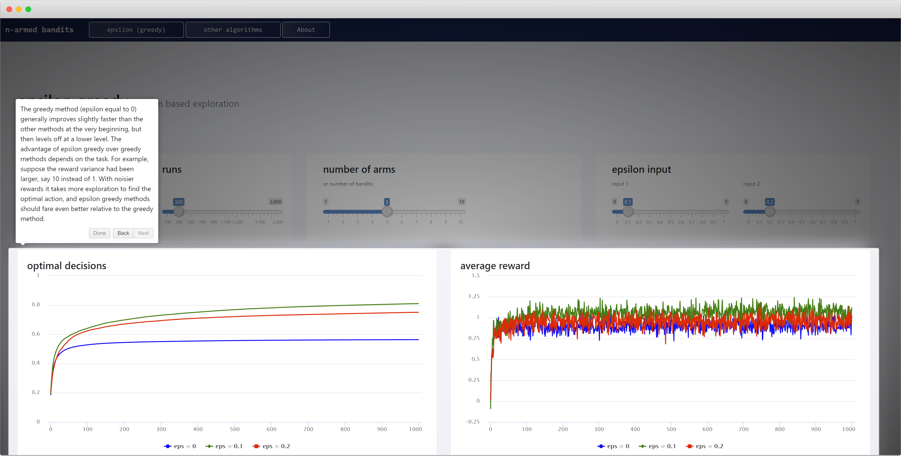

# N-Armed Bandits - R Shiny, Heroku, HTML Templates

The idea behind this application is to allow for an interactive way of seeing the n-armed bandit problem in action. Content is based on Sutton, Richard S., and Andrew G. Barto. Reinforcement learning: An introduction. MIT press, 2018.





## Getting Started

The application is designed to install all necessary libraries on start and should be easy to run locally. Running the commands below from a terminal should do the trick (ensure git and R are installed), the application can be accessed on localhost:3000 or localhost:<PORT> if PORT is an environment variable.

```
git clone https://github.com/MichaelHogers/narmedbandits.git
cd narmedbandits
R
source('run.R')
```

## Deployment

This application is deployed via heroku on a free dyno: https://narmedbandits.herokuapp.com/. If you are interested in deploying an R Shiny application to Heroku, consider following https://elements.heroku.com/buildpacks/btubbs/heroku-buildpack-shiny or https://github.com/virtualstaticvoid/heroku-buildpack-r, the latter was used here but the former seems more up-to-date.

## HTML Templates

This application shows how to use HTML Templates, https://shiny.rstudio.com/articles/templates.html, an alternative way of creating R Shiny UI. This application does not show how to create multiple pages with HTML Templates, which can be achieved with a set of JavaScript functions.

## Authors

* **Michael Hogers** - *Initial work* 

